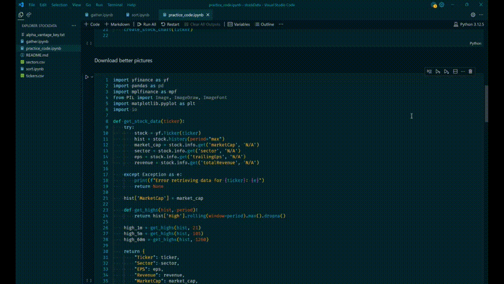

# Stock Data Analysis and Visualization

This project is a Python-based tool for fetching, analyzing, and visualizing stock data. It uses popular libraries like `yfinance`, `pandas`, and `matplotlib` to generate comprehensive financial insights and comparisons, making it a great project for showcasing data analysis and visualization skills.

## Features

- **Stock Data Fetching**: Retrieves historical stock prices, financials, float shares, and sector data.
  
- **Comprehensive Visualization**: Candlestick charts, volume, EPS, revenue, and sector comparisons.
   
- **Error Handling**: Graceful fallback for missing financial or sector data.
- **Sector Comparison**: Compare stock performance against its sector index.

## Technologies Used

- **Python 3.8+**
- **yfinance** for stock data
- **pandas** for data manipulation
- **matplotlib** and **mplfinance** for plotting
- **datetime** for handling dates

## Installation

1. Clone the repository:

   ```bash
   git clone https://github.com/your-username/stock-data-analysis.git
   cd stock-data-analysis
